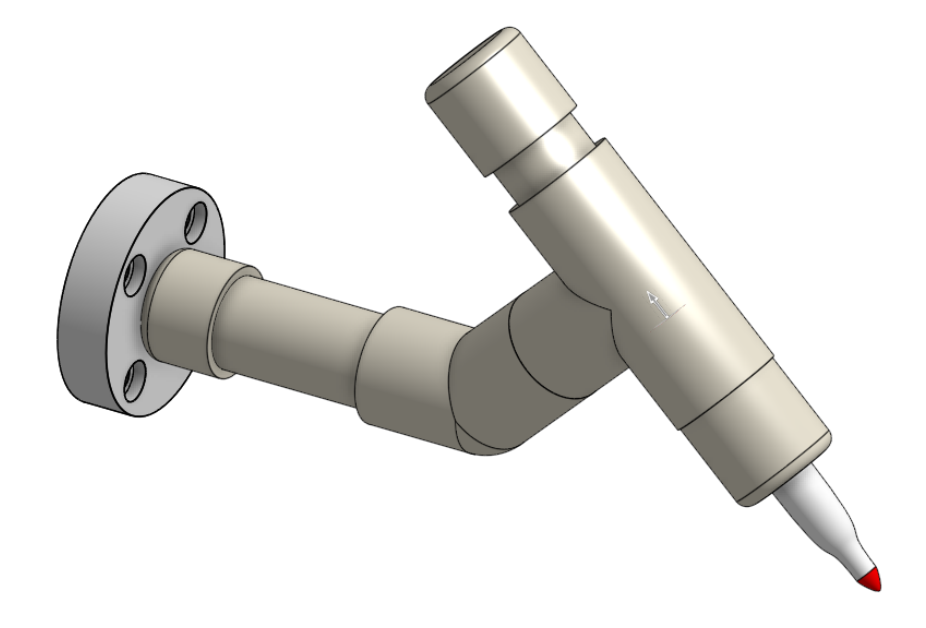
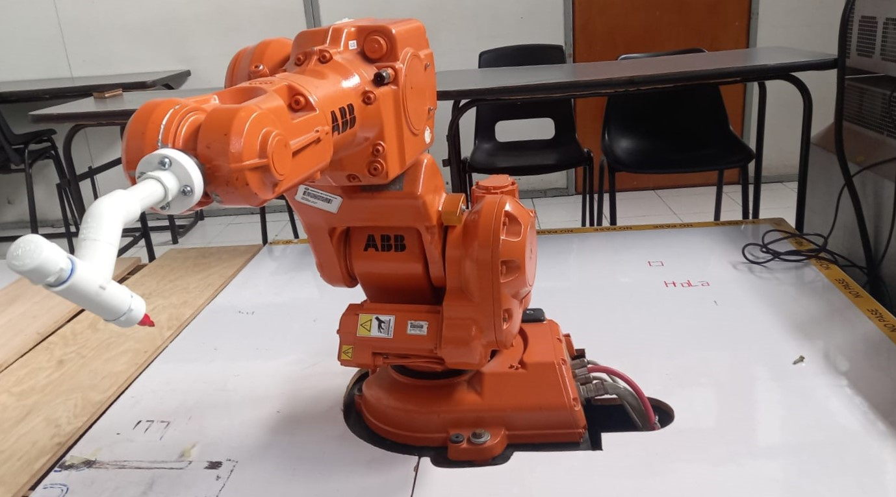
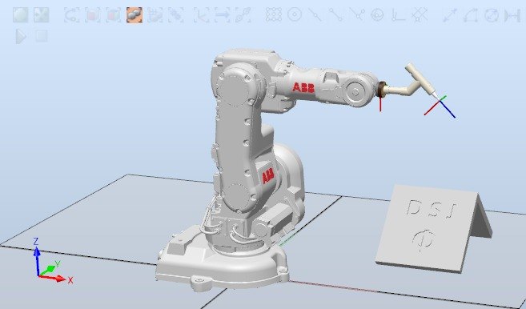
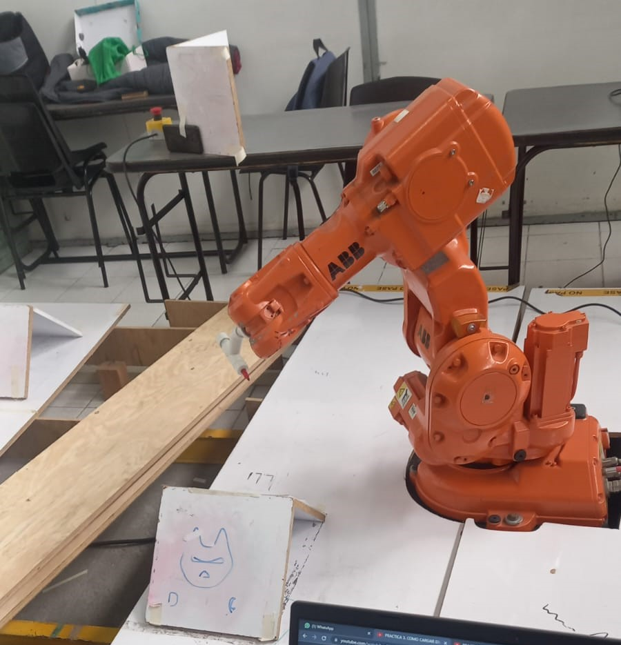

# Laboratorio 1 - Robótica Industrial No. 1

### Por: Sebastian Campiño Figueroa, Julián Felipe Luna Castro y Diego Fernando Mejía Hernández

Este repositorio contiene las memorias y programas desarrolladas durante la primera practica de laboratorio de la materia Robótica. Esta practica esta orientada a aprender a manejar el manipulador *ABB IRB 140* en el espacio del laboratorio *LabSIR* con el controlador *ABB IRC5*. El objetivo planteado es lograr escribir las iniciales de los miembros del equipo de trabajo (D S J) con un marcador en un tablero inclinado, haciendo uso de una herramienta de diseño libre acoplada al manipulador y definiendo las trayectorias en *Robot Studio*.

## Requerimientos
* Robot Studio versión 5 o superior
* Hoja de datos del manipulador industrial IRB 140
* Software CAD (OnShape y AutoDesk Inventor)
* Manipuladores industriales ABB IRB 140
* Controlador ABB IRC5
* Herramienta

## Diseño de la herramienta
La herramienta se diseño partir de tubos de PVC de 1/2", acoples de PVC (codos y Ts) y una base impresa en 3D que sirve de acople a la brida del manipulador, todo esto unido a presion y por un tornillo M8 de 35mm de largo. Para la punta de la herramienta se utilizo un marcador sharpie y se añadieron resortes para evitar daño por colision y lograr una mejor escritura en superficies desiguales. En la siguiente imagen podemos ver un render del modelo realizado en el programa en linea *OnShape* (https://cad.onshape.com/). 

Esta herramienta es simetrica respecto al plano *X-Z*, no está alineada con el eje de la muñeca del manipulador (lo cual deberia ayudar a evitar singularidades) y el tcp esta rotado 45&deg; con respecto al eje *y*. A continuación podemos observar el manipulador con la herramienta ya montada.

## Tablero
Se modela el tablero con las letras a dibujar, en este caso las letras D, S y J mayúsculas y la letra Phi debido a que es la que representa a nuestra facultad. El tablero tiene medidas de 30cm x 30cm con una inclinación de 45° respecto a la base, toda esta información es recopilada de los tableros presentes en el laboratorio.

## Simulación en Robot Studio
En Robot Studio se importa la herramienta y el tablero, se ubican en el plato portaherramientas (Articulación 6) del robot y en el suelo respectivamente, se crea el Work Object y su orientación a partir de  tres puntos dentro del tablero, luego se definen las orientación y TCP de la herramienta, una vez hecho esto se generan las trayectorias (Paths) con la herramienta Autopath para cada letra y a su vez se definen las distancias de aproximación para cada letra, se alinea la orientación de todos los targets o puntos de los Paths (Letras) para que estén en una misma dirección al momento de que la herramienta pase por esos puntos, posteriormente se definen dos puntos (JoinTargets) para ser los puntos Home y el punto de acercamiento, después de esto se define un Jerk z=10 y una velocidad v=200 para el movimiento del robot, se genera el código RAPID con todos los puntos (el cual se puede encontrar en la carpeta *RobotStudio* de este repositorio) y trayectorias según el orden que definimos [(ver video)](#VideoSimulación)  y se exporta el programa para poder usarlo en el robot físico.

## Definición del WorkObject haciendo uso del FlexPendant
Con la herramienta montada en el manipulador y el tablero ubicado en el espacio de trabajo, podemos proceder con el FlexPendant a realizar la ubicacion del workobject del tablero, acercando la punta de la herramienta a tres puntos del tablero que nos permita ubicar el origen de la misma forma a como se definio en Robot Studio.

## VideoSimulación:
A continuacion podemos ver un corto video con la simulacion en Robot Studio de los movimientos del manipulador para realizar la trayectoria de escritura en el tablero.
<video width="320" height="240" controls>
  <source src="./video/RobotStudioSim.mp4" type="video/mp4">
</video>